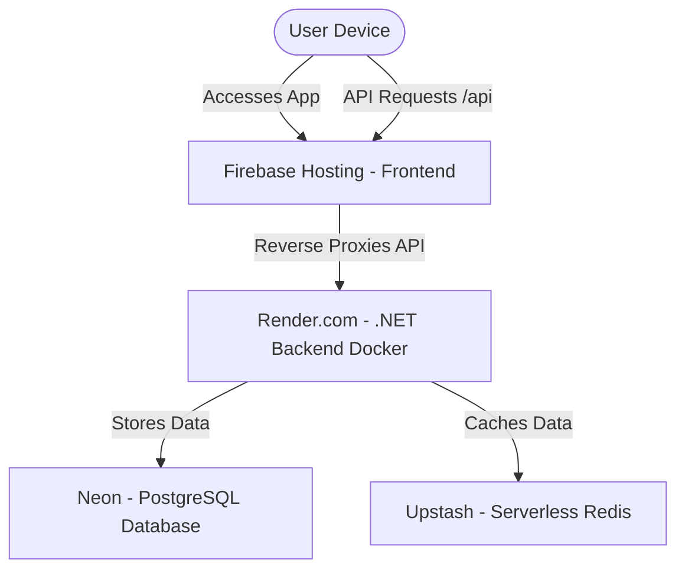

# HealSync Deployment Guide

This document contains step-by-step instructions to deploy the HealSync application frontend and backend to free hosting platforms.

---

## Architecture Overview



---

## 1. Frontend Deployment (Firebase Hosting)

Firebase Hosting is free, fast, and secure. We will configure it to **reverse proxy** all `/api` requests to Render, which prevents CORS (Cross-Origin Resource Sharing) issues completely.

### Step 0: Create a Firebase Project on Web Console
1. Open your web browser and go to the [Firebase Console](https://console.firebase.google.com/).
2. Log in with your Google Account (`shivapatel1102001@gmail.com`).
3. Click the **"Add Project"** (or **"Create a Project"**) card.
4. Enter a name for your project (e.g., `healsync-medical-app` or `doctor-appointment-system`).
5. Click **Continue**.
6. (Optional) You can **disable Google Analytics** for this project to speed up creation.
7. Click **Create Project** and wait about 10 seconds for it to finish.
8. Once ready, click **Continue** to go to your project dashboard.

### Step 1: Install Firebase CLI
Install the Firebase command-line tools globally on your machine:
```bash
npm install -g firebase-tools
```

### Step 2: Build the Angular App
Navigate to the frontend folder and compile the production build:
```bash
cd doctor-appointment-frontend
npx ng build
```
This outputs the build files to `dist/doctor-appointment-frontend`.

### Step 3: Initialize Firebase
Run the initialization wizard:
```bash
firebase login
firebase init hosting
```
* **Select Project:** Choose **Use an existing project** and select your project name.
* **Public Directory:** Enter `dist/doctor-appointment-frontend`.
* **Single Page App:** Enter `y` (Yes, rewrite all URLs to `/index.html`).
* **Automatic Deploys with GitHub:** Enter `n` (No).

### Step 4: Configure API Proxy (firebase.json)
Open the generated `firebase.json` file in the frontend folder and update it to proxy `/api` traffic to your Render backend URL:
```json
{
  "hosting": {
    "public": "dist/doctor-appointment-frontend",
    "ignore": [
      "firebase.json",
      "**/.*",
      "**/node_modules/**"
    ],
    "rewrites": [
      {
        "source": "/api/**",
        "function": "https://YOUR-RENDER-BACKEND-URL/api/**"
      },
      {
        "source": "**",
        "destination": "/index.html"
      }
    ]
  }
}
```
*(Replace `https://YOUR-RENDER-BACKEND-URL` with your actual Render deployment URL).*

### Step 5: Deploy
Run the deploy command:
```bash
firebase deploy
```
Firebase will provide you with a hosting URL (e.g., `https://healsync.web.app`).

---

## 2. Backend Deployment (Render.com)

Render builds and runs your .NET backend using Docker.

### Step 1: Push Dockerfile to GitHub
Make sure the `Dockerfile` in `DoctorAppointmentSystem/` is pushed to your Git repository.

### Step 2: Create Web Service on Render
1. Log in to [Render.com](https://render.com/).
2. Click **New +** -> **Web Service**.
3. Link your GitHub repository.

### Step 3: Configure settings
* **Name:** `healsync-backend`
* **Root Directory:** `DoctorAppointmentSystem`
* **Runtime:** `Docker`
* **Instance Type:** `Free`

### Step 4: Set Environment Variables
Add these key-value pairs in **Advanced** -> **Environment Variables**:
* `ConnectionStrings__DefaultConnection` = *[Your Neon Connection URL]*
* `ConnectionStrings__RedisConnection` = *[Your Upstash Connection URL]*
* `MailSettings__Host` = `smtp.gmail.com`
* `MailSettings__Port` = `587`
* `MailSettings__Mail` = *[Your Gmail Address]*
* `MailSettings__DisplayName` = `HealSync Medical Network`
* `MailSettings__Password` = *[Your Gmail App Password]*

Click **Create Web Service**.

---

## 3. Database Deployment (Neon PostgreSQL)

Neon is a serverless PostgreSQL database with a free tier.

### Step 1: Create a Neon Project
1. Log in to [Neon.tech](https://neon.tech/).
2. Create a new project. Neon will provision a default database named `neondb`.

### Step 2: Create target database
1. Click the **Databases** tab in Neon console.
2. Click **New Database** and name it `DoctorAppointmentDb`.

### Step 3: Connect
Your connection string ends with `/DoctorAppointmentDb` and is passed to Render as `ConnectionStrings__DefaultConnection`.

---

## 4. Cache Deployment (Upstash Redis)

Upstash provides serverless Redis hosting with a free lifetime tier (10,000 commands/day).

### Step 1: Create Upstash database
1. Log in to [Upstash.com](https://upstash.com/).
2. Click **Create Database**. Select a region close to your Render server.

### Step 2: Copy URL
Copy the `rediss://...` connection URL under the Connection Details tab and set it in your Render environment variables as `ConnectionStrings__RedisConnection`.

---

## 5. Docker Configurations

We use a multi-stage Docker build to build and run the .NET 10 Web API securely:
* **Build Stage (`sdk:10.0`):** Restores dependencies and compiles the source code in Release mode.
* **Publish Stage:** Packages the compiled output for hosting without including build tools.
* **Runtime Stage (`aspnet:10.0`):** Launches the packaged application. Binds automatically to port `8080` (expected by Render).

---

## 6. Understanding CORS Configuration (Cross-Origin Resource Sharing)

We added a CORS policy in `Program.cs` to allow your frontend app to communicate directly with your backend server.

### What is CORS? (A Simple Analogy)
Imagine your backend API is a **Private Apartment Building**, and a web browser is the **Security Guard** standing outside. 

By default, the browser enforces a security rule: **"If a website lives on Domain A (e.g. Firebase), it is not allowed to talk to Domain B (e.g. Render) unless Domain B explicitly gives permission."**
* If the backend doesn't give permission, the browser blocks the connection, and your frontend app gets a red error: `"Blocked by CORS policy"`.

### What does our code do?
The code we added in `Program.cs` acts as the backend's **written invitation** to the security guard:
```csharp
builder.Services.AddCors(options =>
{
    options.AddDefaultPolicy(policy =>
    {
        policy.AllowAnyOrigin()   // "Anyone is welcome to call my API (e.g. Firebase, localhost)"
              .AllowAnyHeader()   // "They can send any header (like user login tokens)"
              .AllowAnyMethod();  // "They can perform any action (GET, POST, DELETE, etc.)"
    });
});
```
This tells the browser: *"It is safe to let websites request data from this server."*

