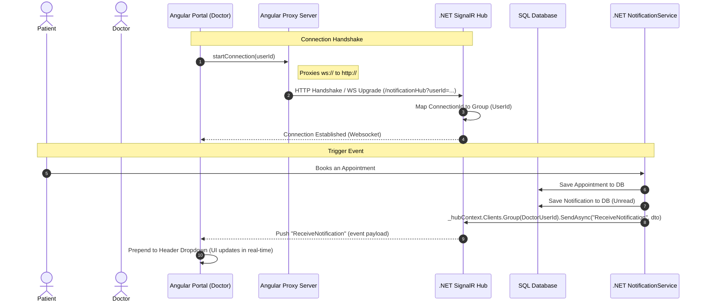

# ASP.NET Core & Angular SignalR Real-Time Notification Guide

This guide explains the complete architecture, step-by-step setup, and flow of real-time notification events in this application using **ASP.NET Core SignalR** on the backend and **@microsoft/signalr** in the Angular frontend.

---

## 1. What is SignalR?
SignalR is an open-source library for ASP.NET that simplifies adding real-time web functionality to applications. Real-time web functionality is the ability to have server code push content to connected clients instantly as it happens, rather than having the client periodically pull/request data.

SignalR automatically chooses the best transport protocol available on both the server and client:
1. **WebSockets:** A full-duplex, persistent connection protocol (fastest, preferred).
2. **Server-Sent Events (SSE):** A one-way push from server to client (fallback).
3. **Long Polling:** The client opens a request, the server keeps it open until data is available, then closes it and repeats (last fallback).

---

## 2. Event Lifetime & Data Flow



---

## 3. Step-by-Step Code Configuration (.NET Backend)

### Step A: Define the Hub (`NotificationHub.cs`)
The **Hub** is the central point in your ASP.NET Core application that handles connections, disconnections, and client-server messages.
We map users to individual SignalR **Groups** named after their `UserId`. When a user has multiple tabs open, all their connection IDs are added to the same group.

```csharp
public class NotificationHub : Hub
{
    public override async Task OnConnectedAsync()
    {
        var userIdStr = Context.GetHttpContext()?.Request.Query["userId"];
        if (Guid.TryParse(userIdStr, out var userId))
        {
            // Add user connection to their personal room/group
            await Groups.AddToGroupAsync(Context.ConnectionId, userId.ToString());
        }
        await base.OnConnectedAsync();
    }
}
```

### Step B: Register Services and Hub Endpoint (`Program.cs`)
1. Register SignalR in the dependency container:
   ```csharp
   builder.Services.AddSignalR();
   ```
2. Map the hub to an endpoint in the request pipeline:
   ```csharp
   app.MapHub<NotificationHub>("/notificationHub");
   ```

### Step C: Trigger Notifications (`NotificationService.cs`)
Inject `IHubContext<NotificationHub>` into your service. When creating a notification, save it to the SQL database first (for history) and then push it down the WebSocket pipe:
```csharp
public async Task CreateNotificationAsync(Guid userId, string message)
{
    var notification = new Notification { ... };
    _dbContext.Notifications.Add(notification);
    await _dbContext.SaveChangesAsync(); // 1. Save to DB

    // 2. Map to Dto
    var dto = new NotificationDto { ... };

    // 3. Push real-time over WebSocket to the user's group
    await _hubContext.Clients.Group(userId.ToString()).SendAsync("ReceiveNotification", dto);
}
```

---

## 4. Step-by-Step Code Configuration (Angular Frontend)

### Step A: Configure Proxy with WebSockets (`proxy.conf.json`)
Since the Angular dev server runs on port `4200` and the C# API runs on port `5222`, we must proxy WebSocket handshakes (`ws://`) and enable WebSocket forwarding:
```json
{
  "/api": {
    "target": "http://localhost:5222",
    "secure": false,
    "changeOrigin": true
  },
  "/notificationHub": {
    "target": "http://localhost:5222",
    "secure": false,
    "changeOrigin": true,
    "ws": true // Crucial for WebSocket upgrades
  }
}
```

### Step B: Service Connection Wrapper (`notification.service.ts`)
We use the official `@microsoft/signalr` package to configure the client hub connection, automatic reconnects, and listener events:
```typescript
@Injectable({ providedIn: 'root' })
export class NotificationService {
  private hubConnection?: HubConnection;
  private notificationReceivedSource = new Subject<NotificationDto>();
  public notificationReceived$ = this.notificationReceivedSource.asObservable(); // Listen in components

  startConnection(userId: string): void {
    this.hubConnection = new HubConnectionBuilder()
      .withUrl(`/notificationHub?userId=${userId}`) // Handshake query parameter
      .withAutomaticReconnect() // Auto retry if socket disconnects
      .build();

    // Map incoming hub trigger to our RxJS Subject
    this.hubConnection.on('ReceiveNotification', (notification: NotificationDto) => {
      this.notificationReceivedSource.next(notification);
    });

    this.hubConnection.start().catch(err => console.error(err));
  }
}
```

### Step C: Handle Incoming Events in UI Component (`header.component.ts`)
Initialize the connection on component load and subscribe to the push events:
```typescript
ngOnInit(): void {
  const userId = this.authService.getUserId();
  if (userId) {
    this.loadNotifications(); // Load history from SQL
    this.notificationService.startConnection(userId); // Connect WebSocket

    // Prepend new notifications on arrival
    this.signalrSub = this.notificationService.notificationReceived$.subscribe({
      next: (notification: NotificationDto) => {
        this.notifications = [notification, ...this.notifications];
      }
    });
  }
}

ngOnDestroy(): void {
  this.notificationService.stopConnection(); // Avoid memory leaks on logout/destroy
}
```
